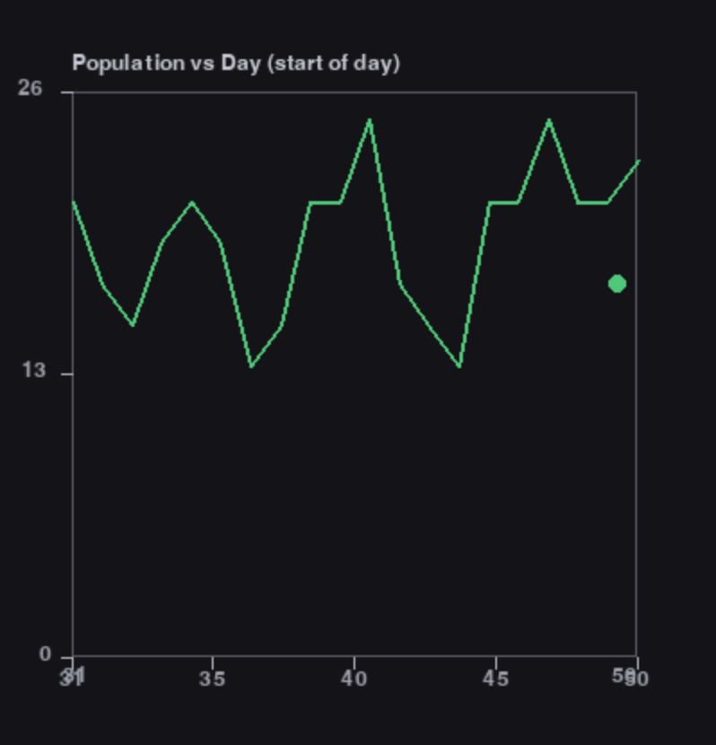
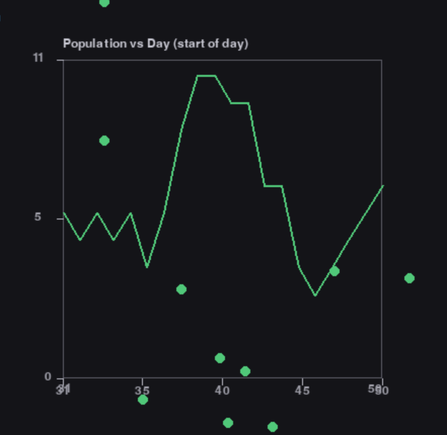
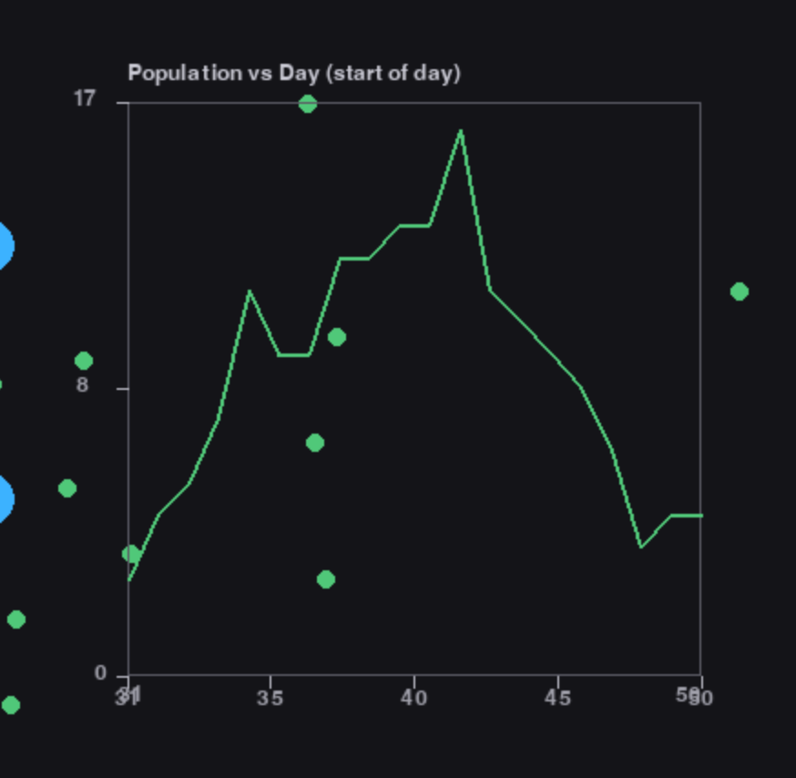
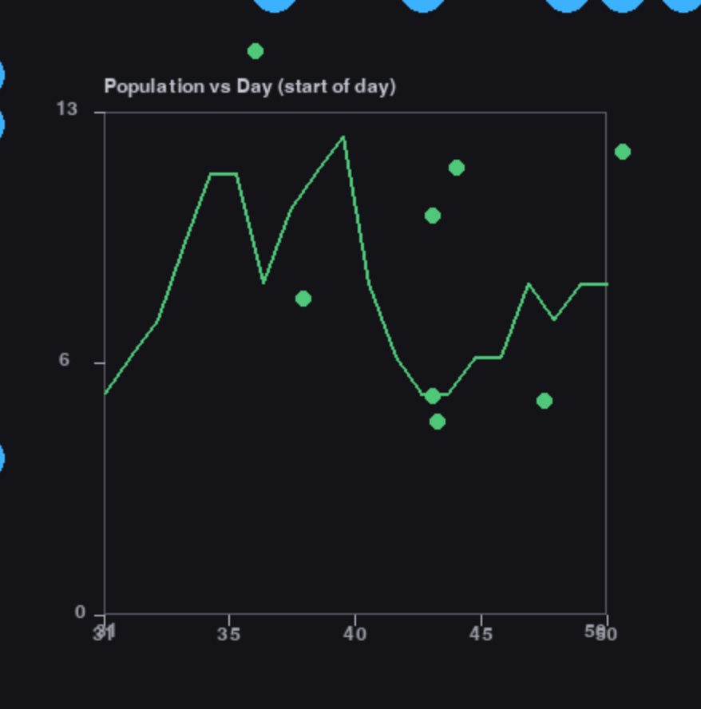
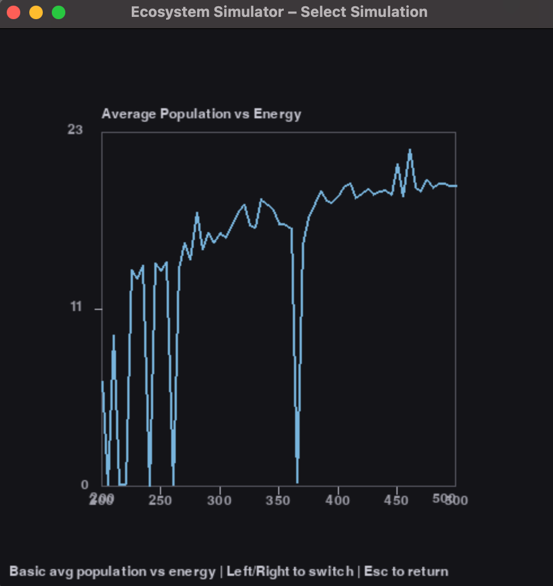
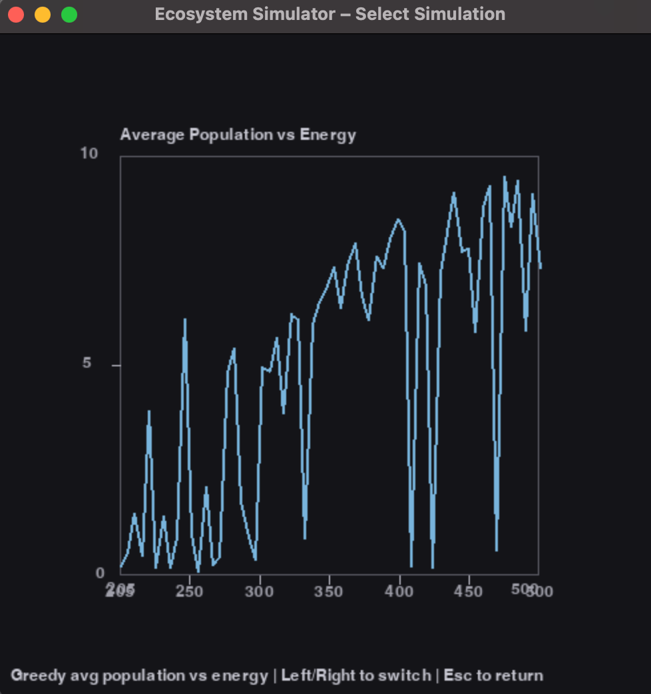
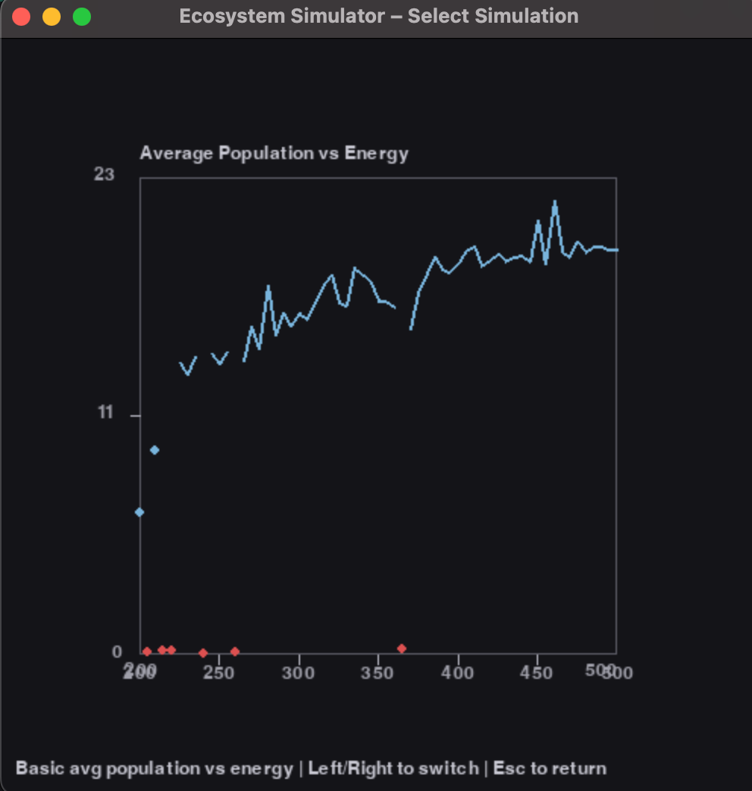
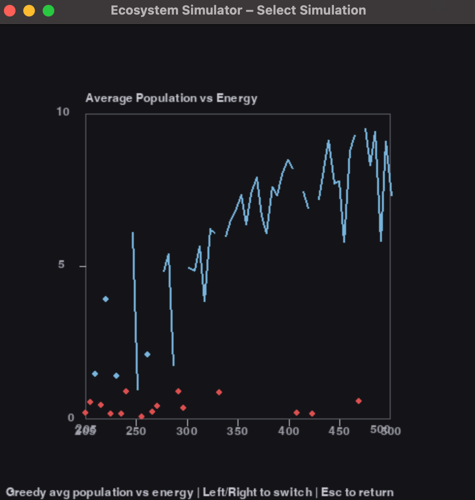
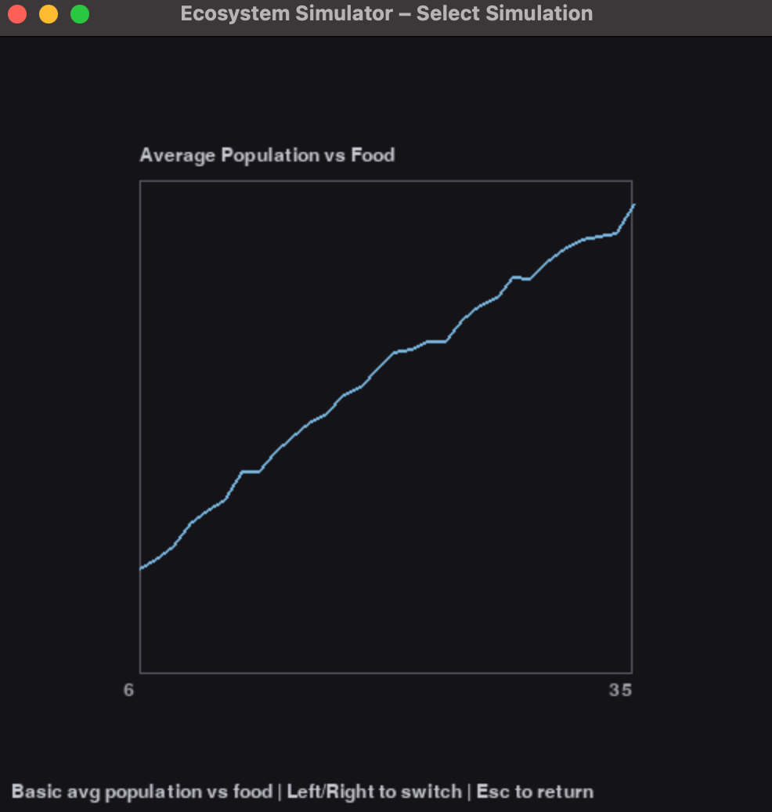
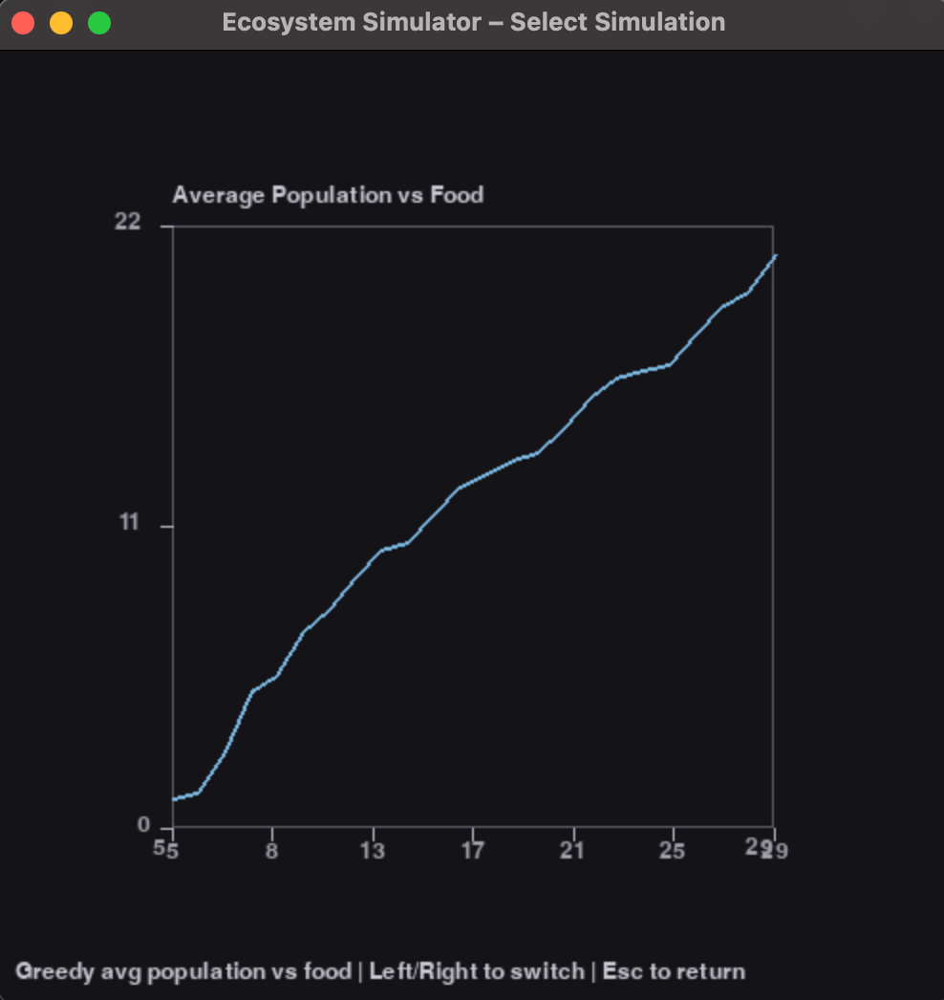

# Dev Log

## Information

I started this developer log so I could document my progress on this project over time and help myself evaluate my strengths and weaknesses. However, I also thought it could be useful to anyone who wanted to follow along this project, whether that be in real time or in the future.

## Entries

### 10/10/2025

Before I start this entry, I feel that there is an important distinction to be made. When I mention a "simulation", I am referring to a single run of the program which may last multiple days, whereas when I mention a "day", I am referring to a single iteration of the simulation loop where creatures move around, eat food, and possibly reproduce.

The first change I made today was that I made creatures gain a fixed amount of energy (constant--set to 250 for now) when they eat food, rather than having their energy reset to max. I also made it so that if a creature's energy exceeds the max energy when they eat food, it is capped at the max energy.

I was planning for my next change to be implementing mutations, but decided I wanted to do another run of data collection, this time with average population changing as a function of time (days) for both `basic_simulation` and `greedy_simulation`. I set up the code to run 40 days for each max energy level from 200 to 500 (in increments of 5) and average the population as a function of days. Below I will explain some of the graphs I observed during this.

1 Day of Basic Simulation

    

3 Days of Greedy Simulation

    
    
    

As you can tell, on the small scale the basic simulation tends to be more volatile (with frequent high and low population spikes), but in the long run tends to remain around the same average population. The greedy simulation, on the other hand, tends to be much more stable on the small scale, but in the long run tends to have a much more volatile average population.

This is *especially* apparent when you look at the average population graphs as a function of energy:

Volatile Basic and Greedy Simulation

    
    

Notice how much more consistent the volatility is in the greedy simulation compared to the basic simulation. This is likely because of the fact that in the greedy simulation, food is placed randomly, it only takes 1 day of bad luck to cause a significant population drop, and those drops have a much more significant effect on the average population. To help view general trends in these graphs, I also created "smoothed" versions of them, cutting out the line for extremities and plotting them as scatter points instead:

Smoothed Basic and Greedy Simulation

    
    

Even so, it's still difficult to view the general trend of the greedy simulations due to consistent volatility. However, the higher the energy, the less volatile the population seems to be, which makes sense because creatures can move around more and have a higher chance of finding food and building a stable population.

An interesting and related phenomenon to explore at a later date would be finding the minimum population that (with little error) guarantees long-term survival of the population in a given ecosystem. In other words, is there a specific number/threshold of creatures that, if the population reaches it, the population is guaranteed to live for a significant amount of time (or forever)? Or perhaps the inverse: if the population drops below it, the population is guaranteed to go extinct?

In terms of project functionality, today was mostly QOL improvements and data collection. I did not add mutations as I had planned, but I think it was worth it to collect this data first. Now, I am ready to move on to mutations, which I will likely start on in the next entry.

### 10/09/2025

Midterm season is over so we are back on the grind. I've made a couple small changes since the last entry, but nothing super huge. The main thing was that I tried to make a function to begin limiting the population instead of letting it exponentially scale infinitely, but it did not work how I expected so I reverted the program.

I'm adding a list here of things I've changed today which I'll update as I code, some of which are explained more in depth later in this entry:
- Removed the 20 day cap for simulations
- Added scaling vs. non-scaling food support
- Added capability for creatures to consume more than (1 for basic, 2 for greedy) foods
    - Only functional advantage for the creature is that their energy is reset
- Verbose option for logging creature states
- Simulations meant for collecting data
    - Specifically, Basic and Greedy Simulation observing average population as a function of static food
    - Also a new menu option for viewing logged data

Since in real ecosystems the food will not simply scale infinitely, I realized that it was rather unrealistic to model my simulations in this way. As a result, I added functionality for non-scaling (constant) food values throughout multiple days of a simulation, meaning that until mutations are added, the only variable changing between days is the creature populaton.

I kept the functionality for scaling (non-constant) food values in case I want to return there later for the purposes of data collection, so it is now an option in the main menu. While adding this, I also removed the extremely unreadable print statements and created a custom "`toString`" for the Creature class. Along with this is an option in the main menu to enable verbosity to begin with.

I also gave creatures the ability to eat more than enough food in order to introduce chaos into the environment that we also tend to see real ecosystems. When I say more than enough, I really mean that they can eat food even when the only functional advantage they gain is that their energy is reset to max. For `greedy_simulation`, this would be eating >2 foods, and for `basic_simulation` this would be eating >1 food.

Lastly, I created a new menu option for running simulations meant for collecting data. This is because I want to be able to run multiple simulations in a row with the same parameters and then average the results. The first simulation type I added for this is `basic_simulation`, which collects data on average population as a function of static food. I also added `greedy_simulation` here as well, and possibly more in the future.

You can either view the logged data in the csv files directly, or you can use the new menu option to visualize the data in graphs. The graphs are not super pretty, but they get the job done for now.

A cool observation I made today: compared to `basic_simulation`, `greedy_simulation` seems to have a much lower average population in the long run, but when the simulation first started, `greedy_simulation` had a much higher rate of population increase. I wish I had an explanation for why I'm observing this, but I don't. I would think they would perform the same in terms of slope because both simulations allow creatures to eat multiple foods, but its possible the randomness of food placement in `greedy_simulation` is causing this difference. I'll keep observing this as I add more features.

Here are those graphs:

For the next couple of entries, I plan to add mutations to the simulations, starting with speed mutations. This would be useful because it would allow me to collect more data like what I collected today, but with a new variable (such as speed mutation chance). I also plan to add more simulations, such as the additional greed rewarding and pandemic simulations mentioned in the last entry.

Another thing Primer did *excellently* in his video was plotting how the most successful combinations of mutations (since they each have upsides and downsides) tended to dominate the population over time, as well as how the graph showed a trend towards an optimization of these mutations based on the environment. I definitely want to implement this in my project as well, so I will likely be working towards that in the next few entries, but it's a huge stretch so I'm not expecting it any time soon.

Smaller additions that I'll be adding next time:
- Energy being increased but not necessarily reset to max on eating food
- More detailed logging of creature states (age, energy, food eaten, mutations, etc.)
- More data collection (such as average energy, age, etc.)

Lastly, I should at least mention the topic of implementing AI into this project. I have been thinking about it, and I think it would be a really cool addition, but I also think it would be a lot of work to implement properly. I would LOVE to do some training with AI and see how it adapts, but it's important to remember that adding AI would be an entirely different branch of this project, and I don't want to get too sidetracked from my main goal of observing emergent behavior in a simulated ecosystem. So for now, I will put AI on the back burner, but I will definitely revisit it in the future if time permits. I do still value the idea of having AI and seeing how data collection changes, and that would also be a great way to extend off the great work Primer has already done.

### 09/30/2025
Today I started the project. I went and rewatched the youtube video which inspired this project to begin with, to understand the rationale behind how he was choosing parameters for his simulation, but when it came to selecting my own parameters, I knew I wanted to come up with new ones rather than reusing his. This is for the sake of research and possibly locating phenomenon, which is why I took on this project to begin with.

Today's work entailed creating the main menu, as well as setting up the simulations. I started off by writing all my code in one simulation.py file, and then as I realized I wanted to expand to different simulation types, I renamed the file to basic_simulation.py and refactored as much reusable code from there into a new simulation.py file as I could. This helps a lot because it meant I wouldn't have to write giant files each time I wanted to invent a new type of simulation.

I also created graphs in between simulations to help visualize the population as a function of time (days). This was nice, but since I haven't tweaked too many inputs for my simulation I haven't noticed any unexpected phenomenon. Perhaps the more complex simulations I'm planning will ellicit something?

The csv files I set up for data collection/logging are great, but not super helpful, and they don't contain a whole lot of metrics either. I think next I will set up more data collection in the files, and create a limited history of simulations to view multiple graphs at once (widespread data analysis).

I should also list out some of the mutations I plan to add in the future since I'm already thinking about them:
* Speed Mutations - moving faster compared to other creatures
* Intelligence Mutations - having a sense of food location
    * Three ways to restrict the power of this:
        * Range - like a radar, still requiring them to get close
        * Error - like a cone, indicating a range of directions
        * Possibly a mix of the two above?
* Size Mutations - being bigger makes it easier to eat

As for fundamental simulation changes I plan to observe for the purpose of data collection:
* Greed Rewarding
    * Benefits for eating more than 2 food
    * Basically even more greedy version of greedy_simulation
    * No longer random - how does the data change?
* Pandemics
    * Caused by:
        * Eating food
            * No way to avoid
            * How the pandemic starts
        * Touching other creatures
        * Other ways?
    * May ellicit risk comparison
* Other ideas?
    * I'll likely update this list in subsequent entries as I come up with ideas

I'm excited to see what comes of this project next. I'm very eager to get into the data analysis part of this and start observing interesting behaviors.